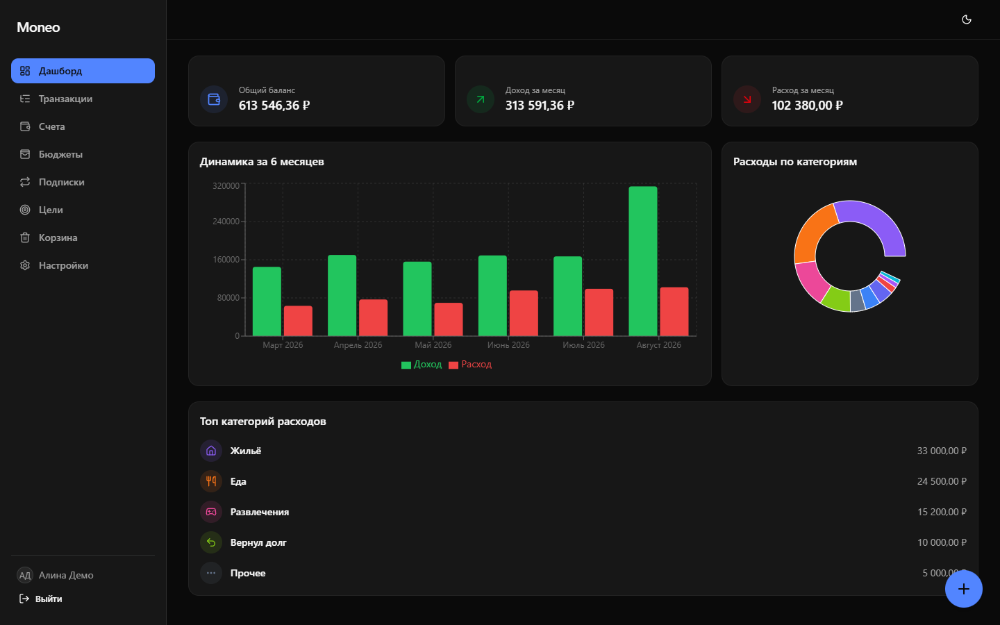
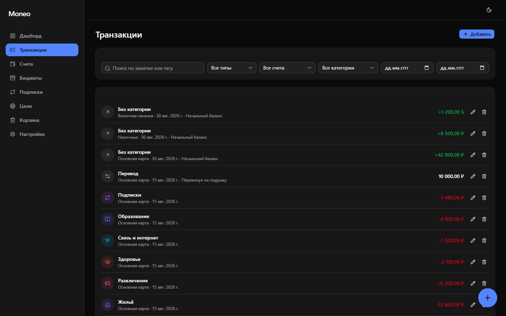
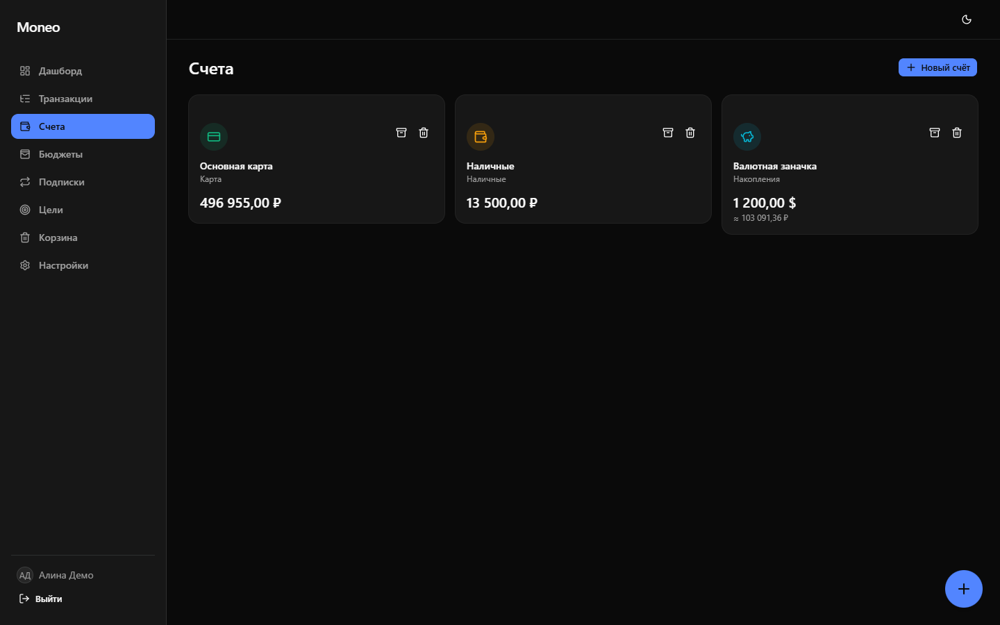
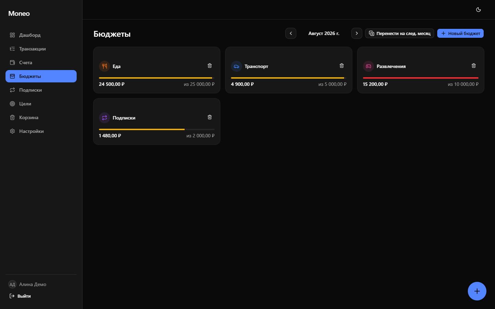
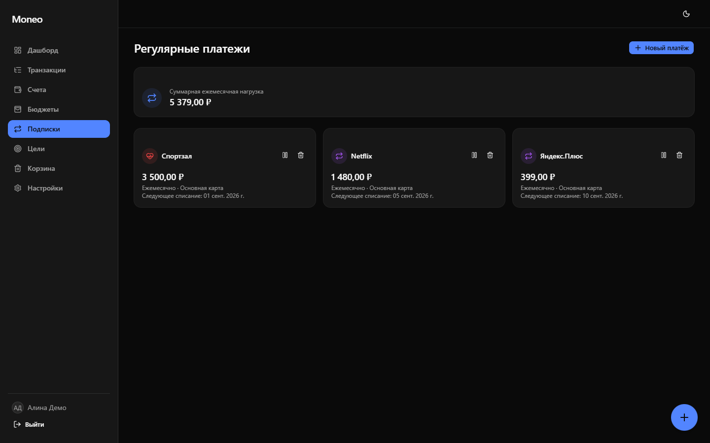
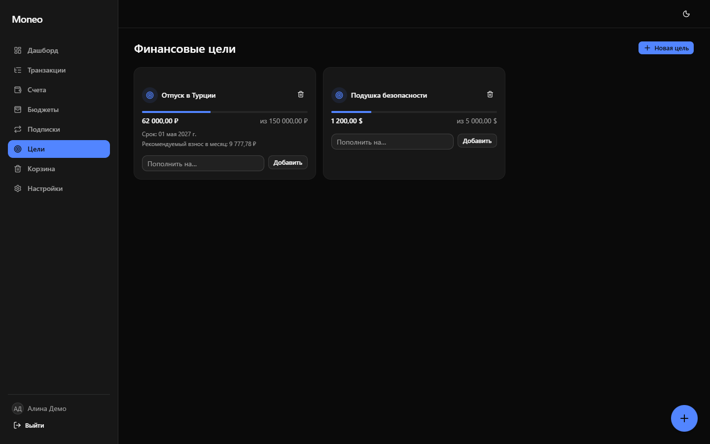
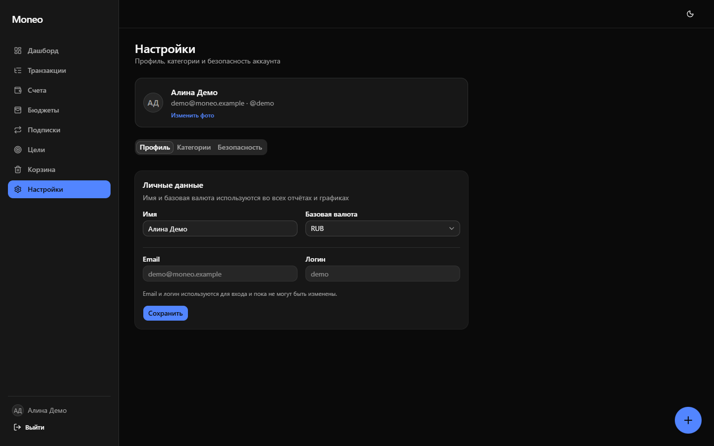

# Moneo

[](backend/pyproject.toml)
[](backend/app/main.py)
[](frontend/package.json)
[](frontend/package.json)
[](docker-compose.yml)
[](docker-compose.yml)

Веб-приложение для личного учёта финансов: доходы и расходы, счета в нескольких
валютах, бюджеты с индикаторами прогресса, регулярные платежи/подписки,
финансовые цели и аналитика с графиками.



## Оглавление

- [Скриншоты](#скриншоты)
- [Возможности](#возможности)
- [Стек](#стек)
- [Структура репозитория](#структура-репозитория)
- [Быстрый старт (Docker)](#быстрый-старт-docker)
- [Разработка без Docker](#разработка-без-docker)
  - [Backend](#backend)
  - [Frontend](#frontend)
- [Переменные окружения](#переменные-окружения)
- [База данных и миграции](#база-данных-и-миграции)
- [Тесты](#тесты)
- [API](#api)
- [Продакшн-деплой на VPS](#продакшн-деплой-на-vps)
  - [Вариант A: чистый VPS, без своего nginx (Caddy)](#вариант-a-чистый-vps-без-своего-nginx-caddy)
  - [Вариант B: на VPS уже есть свой nginx](#вариант-b-на-vps-уже-есть-свой-nginx)
- [Caddyfile: что это и зачем](#caddyfile-что-это-и-зачем)

## Скриншоты

<table>
<tr>
<td width="50%">

**Транзакции** — фильтры, поиск, комиссия по картам



</td>
<td width="50%">

**Счета** — мультивалютность, конвертация в базовую валюту



</td>
</tr>
<tr>
<td width="50%">

**Бюджеты** — индикаторы зелёный/жёлтый/красный



</td>
<td width="50%">

**Регулярные платежи** — суммарная ежемесячная нагрузка



</td>
</tr>
<tr>
<td width="50%">

**Финансовые цели** — прогресс и рекомендуемый взнос



</td>
<td width="50%">

**Настройки** — профиль, категории, безопасность



</td>
</tr>
</table>

## Возможности

- **Аутентификация** — регистрация, вход по email или логину, восстановление
  пароля по email, JWT в httpOnly cookie.
- **Счета** — несколько счетов в разных валютах, архивация, начальный баланс
  при создании; баланс считается из истории транзакций (не хранится отдельным
  полем).
- **Транзакции** — доходы, расходы, переводы между своими счетами; комиссия
  по картам (фиксированной суммой или процентом с быстрыми пресетами
  0.1–2%); поиск по заметке и тегам, бесконечная подгрузка списка вместо
  пагинации, редактирование по клику на саму транзакцию. Фильтры (период,
  тип, счёт, категория) собраны в одной компактной модалке с пресетами
  периода («Сегодня», «7 дней», «Этот месяц», «Этот год», свой диапазон).
- **Выбор даты колесом** — во всех формах (транзакция, регулярный платёж,
  цель, фильтр по периоду) вместо системного `<input type="date">` — колёсный
  пикер день/месяц/год в стиле iOS, с реальными границами (без бесконечной
  прокрутки).
- **Категории** — предустановленный набор (еда, транспорт, жильё, а также
  жизненные ситуации вроде переводов близким и долгов) плюс свои, с иконкой и
  цветом.
- **Корзина** — удаление любого объекта (счёт, транзакция, категория, бюджет,
  регулярный платёж, цель) не стирает его сразу: он попадает в корзину, откуда
  его можно восстановить или удалить безвозвратно.
- **Мультивалютность** — курс фиксируется на момент транзакции и не
  пересчитывается задним числом; курсы обновляются раз в сутки фоновым
  worker'ом из внешнего API.
- **Бюджеты** — месячный лимит на категорию расходов, индикатор
  зелёный/жёлтый/красный, перенос лимитов на следующий месяц.
- **Регулярные платежи** — шаблон с периодичностью (неделя/месяц/год),
  автосоздание транзакций фоновым worker'ом, пауза/удаление, суммарная
  ежемесячная нагрузка.
- **Финансовые цели** — целевая сумма и срок, прогресс-бар, расчёт
  рекомендуемого ежемесячного взноса.
- **Дашборд и аналитика** — общий баланс, доход/расход за период, топ
  категорий расходов, динамика по месяцам, круговая диаграмма по категориям,
  сравнение периодов.
- **UI** — светлая/тёмная тема, интерфейс на русском. Одно и то же боковое
  меню на десктопе и телефоне: на десктопе сворачивается до иконок, на
  телефоне превращается в выезжающую слева панель поверх контента — открывается
  и закрывается одной и той же кнопкой. Никакой горизонтальной прокрутки на
  узких экранах.
- **Демо-аккаунт** — при локальном запуске через Docker Compose бэкенд сам
  создаёт демо-пользователя с полугодовой историей операций, бюджетами,
  подписками и целями — см. [Быстрый старт](#быстрый-старт-docker).

## Стек

**Backend:** Python 3.12, FastAPI (async), SQLAlchemy 2.0 + Alembic,
PostgreSQL, Pydantic v2, passlib[bcrypt], JWT (python-jose), APScheduler,
управление зависимостями через `uv`.

**Frontend:** React + Vite + TypeScript, Tailwind CSS v4 + shadcn/ui (на
Base UI), TanStack Query, Recharts, framer-motion.

**Инфраструктура:** Docker Compose; в проде — либо Caddy (автоматический
HTTPS), либо существующий на VPS nginx — см. [Продакшн-деплой на
VPS](#продакшн-деплой-на-vps).

## Структура репозитория

```
moneo/
 ├─ backend/          FastAPI-приложение
 │   ├─ app/
 │   │   ├─ models/     SQLAlchemy-модели
 │   │   ├─ schemas/    Pydantic-схемы запросов/ответов
 │   │   ├─ api/routers/  роуты, по одному файлу на ресурс
 │   │   ├─ services/   валюты, балансы, регулярные платежи, письма, демо-сид
 │   │   ├─ main.py     точка входа FastAPI (все роуты под /api)
 │   │   └─ worker.py   точка входа фонового планировщика (APScheduler)
 │   ├─ alembic/        миграции БД
 │   └─ tests/          unit-тесты (валюты, бюджеты)
 ├─ frontend/         React + Vite приложение
 │   └─ src/
 │       ├─ pages/      страницы (по одной на раздел приложения)
 │       ├─ components/ переиспользуемые компоненты, включая ui/ (shadcn)
 │       ├─ hooks/      TanStack Query хуки, по одному на ресурс backend'а
 │       └─ lib/        api-клиент, форматирование, утилиты
 ├─ docker-compose.yml             дев-стек: db, backend, worker, frontend
 ├─ docker-compose.prod.yml        база прод-стека: db, backend, worker, frontend (без входа снаружи)
 ├─ docker-compose.prod.caddy.yml  оверлей: + Caddy (для VPS без своего nginx)
 ├─ docker-compose.prod.nginx.yml  оверлей: frontend на 127.0.0.1 (для VPS со своим nginx)
 ├─ deploy/nginx.conf.example      пример конфига хостового nginx для варианта B
 ├─ docs/IDEAS.md      бэклог идей и будущих изменений (не привязан к релизам)
 ├─ Caddyfile
 ├─ .env.example
 └─ CLAUDE.md         заметки по архитектуре для разработки с Claude Code
```

Подробнее об устройстве бэкенда и нетривиальных решениях — в [CLAUDE.md](CLAUDE.md).

## Быстрый старт (Docker)

```bash
cp .env.example .env
docker compose up --build -d
```

- Frontend: http://localhost:5173
- Backend API: http://localhost:8000/docs

Миграции и сид предустановленных категорий применяются автоматически при
старте backend-контейнера. Фоновый `worker`-контейнер сразу подтягивает
курсы валют и раз в час проверяет регулярные платежи.

В dev-стеке (`docker-compose.yml`) backend при первом запуске также создаёт
демо-аккаунт с тестовыми данными за полгода (счета, транзакции, бюджеты,
подписки, цели) — заходите и сразу смотрите:

```
Email:  demo@moneo.example
Пароль: DemoPass123
```

Создаётся один раз и не пересоздаётся при перезапуске. Управляется переменной
`SEED_DEMO_DATA` (см. [Переменные окружения](#переменные-окружения)) — в
прод-конфигах она не задаётся, демо-аккаунт там не появится.

Проверить, что всё поднялось:

```bash
docker compose ps
curl http://localhost:8000/health
```

Пересобрать и перезапустить один сервис после изменений:

```bash
docker compose up -d --build backend   # или frontend / worker
```

## Разработка без Docker

Нужен только PostgreSQL (например, `docker compose up -d db` — поднимет
только базу на порту из `.env`).

### Backend

```bash
cd backend
uv sync
uv run alembic upgrade head
uv run uvicorn app.main:app --reload --loop none
```

**`--loop none` обязателен на Windows** (не опционально): `psycopg` в async-режиме
требует `SelectorEventLoop`, а не `ProactorEventLoop` по умолчанию — подробности
и почему это не ломает Linux/Docker — в [CLAUDE.md](CLAUDE.md). На Linux/macOS
флаг тоже безопасен, но не обязателен.

Запуск фонового worker'а отдельно (курсы валют + регулярные платежи):

```bash
uv run python -m app.worker
```

### Frontend

```bash
cd frontend
npm install
npm run dev
```

По умолчанию фронтенд обращается к `http://localhost:8000` (см.
`frontend/.env`, переменная `VITE_API_URL`).

## Переменные окружения

Полный список — в [.env.example](.env.example). Ключевые:

| Переменная | Назначение |
|---|---|
| `POSTGRES_USER`, `POSTGRES_PASSWORD`, `POSTGRES_DB` | Доступ к PostgreSQL |
| `SECRET_KEY` | Секрет для подписи JWT — сгенерировать: `openssl rand -hex 32` |
| `COOKIE_SECURE` | `true` в проде (HTTPS), `false` для локальной разработки по HTTP |
| `CORS_ORIGINS` | Разрешённые origin'ы для CORS (адрес фронтенда) |
| `EXCHANGE_RATE_API_URL` | API курсов валют (по умолчанию — [open.er-api.com](https://www.exchangerate-api.com/), без ключа) |
| `SEED_DEMO_DATA` | `true` — создать демо-аккаунт с тестовыми данными при старте backend (по умолчанию включено в dev-стеке, `false` иначе; не задавайте в проде) |
| `SMTP_*` | Почта для писем восстановления пароля; если пусто — ссылка на сброс просто пишется в лог backend |
| `VITE_API_URL` | Адрес backend для фронтенда в режиме `npm run dev` |
| `DOMAIN`, `ACME_EMAIL` | Домен и email для автоматического TLS-сертификата Caddy (только прод, вариант A) |
| `APP_PORT` | Порт на `127.0.0.1`, на который публикуется frontend (только прод, вариант B — свой nginx) |

## База данных и миграции

Миграции — Alembic, лежат в `backend/alembic/versions/`.

```bash
cd backend
uv run alembic revision --autogenerate -m "описание изменения"   # новая миграция (нужна живая БД)
uv run alembic upgrade head                                      # применить миграции
uv run alembic downgrade -1                                      # откатить последнюю
```

Индексы расставлены по `user_id` и `date` на часто фильтруемых таблицах
(транзакции, бюджеты, регулярные платежи).

## Тесты

```bash
cd backend
uv run pytest -q                        # все тесты
uv run pytest tests/test_currency.py -q # только конвертация валют
uv run pytest tests/test_budgets.py -q  # только логика бюджетов
```

Тесты покрывают конвертацию валют (кросс-курс через доллар как хаб) и
логику бюджетов (пороги индикатора, пересчёт регулярных платежей в
ежемесячную нагрузку) — это чистые функции без обращения к БД.

## API

Интерактивная документация (Swagger UI) поднимается вместе с backend:
http://localhost:8000/docs. Все эндпоинты смонтированы под префиксом `/api`.

## Продакшн-деплой на VPS

`docker-compose.prod.yml` — общая база (db, backend, worker, frontend), у нее
нет ни одного порта, открытого наружу. Кто именно принимает трафик снаружи и
выпускает TLS — выбирается оверлеем поверх базы, в зависимости от того, есть
ли на VPS уже свой nginx (или другой reverse-proxy).

Общие для обоих вариантов шаги:

1. Установите на VPS Docker и Docker Compose.
2. Склонируйте репозиторий, создайте `.env` из `.env.example` и заполните
   реальными значениями: пароль БД, `SECRET_KEY`, `COOKIE_SECURE=true`.
3. В DNS (Cloudflare) укажите A-запись поддомена на IP VPS, режим — **DNS
   only** («серая тучка»). Проксирование через Cloudflare (оранжевая тучка)
   можно включить позже, когда TLS уже настроен и работает напрямую.

Дальше — по варианту.

### Вариант A: чистый VPS, без своего nginx (Caddy)

Caddy сам займёт порты 80/443 и сам выпустит сертификат Let's Encrypt.

1. Заполните в `.env`: `DOMAIN=ваш-поддомен`, `ACME_EMAIL=ваша-почта`.
2. Запустите:

   ```bash
   docker compose -f docker-compose.prod.yml -f docker-compose.prod.caddy.yml up -d --build
   ```

3. Проверьте выпуск сертификата:

   ```bash
   docker compose -f docker-compose.prod.yml -f docker-compose.prod.caddy.yml logs -f caddy
   ```

Обновление после изменений в коде:

```bash
git pull
docker compose -f docker-compose.prod.yml -f docker-compose.prod.caddy.yml up -d --build
```

### Вариант B: на VPS уже есть свой nginx

Если на машине уже крутится nginx (например, обслуживает другие сайты),
поднимать ещё и Caddy на 80/443 не выйдет — порты уже заняты. В этом случае
Caddy не используется вообще: TLS и проксирование берёт на себя существующий
nginx, а `frontend`-контейнер публикуется только на `127.0.0.1`.

1. В `.env` `DOMAIN`/`ACME_EMAIL` не нужны (это только для Caddy); при
   желании задайте `APP_PORT` (по умолчанию `8090`), если он занят чем-то ещё.
2. Запустите:

   ```bash
   docker compose -f docker-compose.prod.yml -f docker-compose.prod.nginx.yml up -d --build
   ```

   Frontend теперь слушает `127.0.0.1:8090` (или ваш `APP_PORT`) и наружу не торчит.
3. Добавьте хостовый vhost на основе [`deploy/nginx.conf.example`](deploy/nginx.conf.example):

   ```bash
   sudo cp deploy/nginx.conf.example /etc/nginx/sites-available/moneo
   sudo nano /etc/nginx/sites-available/moneo   # впишите свой домен и APP_PORT
   sudo ln -s /etc/nginx/sites-available/moneo /etc/nginx/sites-enabled/
   sudo nginx -t && sudo systemctl reload nginx
   ```

4. Выпустите сертификат через уже имеющийся у вас certbot:

   ```bash
   sudo certbot --nginx -d ваш-поддомен
   ```

Обновление после изменений в коде:

```bash
git pull
docker compose -f docker-compose.prod.yml -f docker-compose.prod.nginx.yml up -d --build
```

(nginx на хосте трогать не нужно — он просто проксирует на тот же порт.)

## Caddyfile: что это и зачем

Актуально только для [варианта A](#вариант-a-чистый-vps-без-своего-nginx-caddy)
(без своего nginx на хосте). `Caddyfile` — конфигурация веб-сервера
[Caddy](https://caddyserver.com/), который в проде играет роль **reverse
proxy**: единственный контейнер,
слушающий порты 80/443 и общающийся с внешним миром, всё остальное
(backend, frontend, db, worker) сидит только во внутренней docker-сети.

Файл всего из нескольких строк:

```caddyfile
{
	email {$ACME_EMAIL}
}

{$DOMAIN} {
	reverse_proxy frontend:80
}
```

- Верхний блок — глобальные настройки: email для Let's Encrypt (нужен для
  выпуска сертификата и уведомлений о его истечении).
- Второй блок — правило для конкретного домена (подставляется из `.env`
  через `{$DOMAIN}`): весь трафик на этот домен проксируется на контейнер
  `frontend` (nginx), который, в свою очередь, сам проксирует `/api/*` на
  `backend` (см. `frontend/nginx.conf`) — поэтому Caddy достаточно знать
  только про фронтенд.

Главное, что делает Caddy и ради чего он тут нужен — **автоматический HTTPS**:
при первом запуске он сам обращается в Let's Encrypt, получает сертификат для
`DOMAIN` и потом сам же его продлевает, без ручной возни с `certbot` или
ручной генерацией сертификатов. Это и есть весь смысл выбора Caddy вместо
голого nginx для прод-конфигурации — конфиг короче на порядок, а HTTPS
работает «из коробки».
